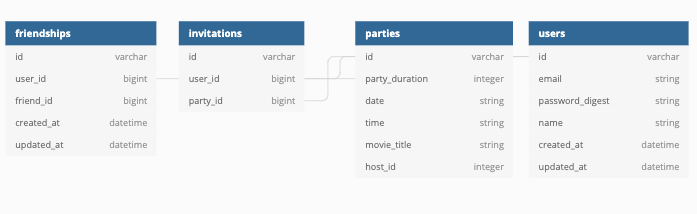

# ViewingParty
<!-- Add link to heroku -->
Click [here]() to try out ViewingParty on herokuapp!

<!-- PROJECT SHIELDS -->
[![Contributors][contributors-shield]][contributors-url]
[![Forks][forks-shield]][forks-url]
[![Stargazers][stars-shield]][stars-url]
[![Issues][issues-shield]][issues-url]
[](https://travis-ci.com/travis-ci/travis-web)


<!-- PROJECT LOGO photo -->
  <!-- Add path to photo from app/assets/images -->
<br />
<p align="center">
  <a href="https://github.com/ETBassist/viewing_party">
    
  </a>

  <h3 align="center">Viewing Party</h3>

  <p align="center">
    Viewing party is an application in which users can explore movie options and create a viewing party event for the user and friend's.
    <br />
    <a href="https://github.com/ETBassist/viewing_party"><strong>Explore the docs »</strong></a>
    <br />
    <br />
    <a href="Add our video link here">View Demo</a>
    ·
    <a href="https://github.com/ETBassist/viewing_party/issues">Report Bug</a>
    ·
    <a href="https://github.com/ETBassist/viewing_party/issues">Request Feature</a>
  </p>
</p>


<!-- TABLE OF CONTENTS -->
## Table of Contents

* [About the Project](#about-the-project)
  * [Built With](#built-with)
* [Getting Started](#getting-started)
  * [Prerequisites](#prerequisites)
  * [Installation](#installation)
  * [Schema](#schema)
* [Usage](#usage)
* [Roadmap](#roadmap)
* [Contributing](#contributing)
* [Contact](#contact)
* [Acknowledgements](#acknowledgements)


<!-- ABOUT THE PROJECT -->
## About The Project

[![about-screenshot][about-screenshot]](https://example.com)

ViewingParty wants to help you connect with your friends and family for movie night, whether you are only 2 minutes or 2000 miles away, all you need is an internet connection!

Here's why:
* Distance should not stop you from sharing a fun movie night with those you care about!
* Convenience. ViewingParty is simplistic in design. Simply select a movie you are intested in and create a viewing party! Easy!  :smile:


A list of commonly used resources and references that our team found helpful in the creation of this project are listed in acknowledgements.


### Built With

* [Ruby](https://github.com/ruby/ruby)
* [Rails](https://github.com/rails/rails)


<!-- GETTING STARTED -->
## Getting Started

To use ViewingParty locally, you can fork or clone [this](https://github.com/ETBassist/viewing_party) repo.


### Prerequisites
Ruby version 2.5.3
Rails version 5.2.4.4

Below are the commands you will need to run in your terminal once you are inside the ViewingParty directory.

* Bundle Install
```ruby
bundle exec install
```
* Set up Database
```ruby
rake db:create
rake db:migrate
```


### Installation

1. Get a free TheMovieDB Developer API Key [here](https://www.themoviedb.org/signup)
2. Clone the repo if you have not already
* ViewingParty
```sh
git clone git@github.com:ETBassist/viewing_party.git
```

3. Install Gems
```ruby
bundle exec install
```
```ruby
bundle exec figaro install
```
4. Add your MovieDB API key in `application.yml`
```ruby
MOVIE_DB_API_KEY: = 'ENTER IN YOUR API KEY'
```


### Schema

After running your migrations, your schema will look something like this!
<br />
<p align="center">
    
</p>


### Architecture

To view and explore the project board we used for the architecture and wireframing of ViewingParty, please visit the project wireframe [here](https://backend.turing.io/module3/projects/viewing_party/wireframes).


<!-- USAGE EXAMPLES -->
## Usage

Run ```rails s``` in your terminal and navigate to ```http://localhost:3000/``` in your local browser.

Once you sign in or register, you will be taken to your ViewingParty dashboard!

Your **Dashboard** is a convenient place to add friends and to view the parties you are hosting or attending!
[![dashboard-screenshot][dashboard-screenshot]](https://example.com)

The **Discover Movies** button takes you to a discover page where you can either search for a movie by name, or discover top rated movies!
[![movies-screenshot][movies-screenshot]](https://example.com)

To create a viewing party, navigate to a movies show page by clicking on a movie title link after. After you have selected a movie and clicked on it's link, you will see a button to **Create Viewing Party**. Clicking on this button will take you to a form where you will choose a party duration, a date / time for your party, as well as select the friends you would like to invite to this party.
[![viewing-party-form-screenshot][viewing-party-form-screenshot]](https://example.com)


<!-- ROADMAP -->
## Roadmap

See the [open issues](https://github.com/ETBassist/viewing_party/issues) for a list of proposed features and known issues.


<!-- CONTRIBUTING -->
## Contributing

Contributions are what make this community such an amazing and fun place to learn, grow, and create! Any contributions you make are **greatly appreciated**.

1. Fork the Project
2. Create your Feature Branch ```git checkout -b feature/NewGreatFeature```
3. Commit your Changes ```git commit -m 'Add some NewGreatFeature'```
4. Push to the Branch ```git push origin feature/NewGreatFeature```
5. Open a new Pull Request!


<!-- CONTACT -->
## Contact

Eduardo Parra - [![LinkedIn][linkedin-shield]](https://www.linkedin.com/in/eduardo--parra/) - [GitHub](https://github.com/helloeduardo)

Eugene Theriault - [![LinkedIn][linkedin-shield]](https://www.linkedin.com/in/eugene-theriault/) - [GitHub](https://github.com/ETBassist)

Jonathan Wilson - [![LinkedIn][linkedin-shield]](https://www.linkedin.com/in/jonathan--wilson/) - [GitHub](https://github.com/Jonathan-M-Wilson)


Project Link: [ViewingParty](https://github.com/ETBassist/viewing_party)


<!-- ACKNOWLEDGEMENTS -->
## Acknowledgements
<!-- Add resources that were used to help create this project here -->
* [TheMovieDB API Docs](https://developers.themoviedb.org/3/getting-started)


<!-- MARKDOWN LINKS & IMAGES -->
[contributors-shield]: https://img.shields.io/github/contributors/othneildrew/Best-README-Template.svg?style=flat-square
[contributors-url]: https://github.com/ETBassist/viewing_party/graphs/contributors
[forks-shield]: https://img.shields.io/github/forks/ETBassist/viewing_party
[forks-url]: https://github.com/ETBassist/viewing_party/network/members
[stars-shield]: https://img.shields.io/github/stars/ETBassist/viewing_party
[stars-url]: https://github.com/ETBassist/viewing_party/stargazers
[issues-shield]: https://img.shields.io/github/issues/ETBassist/viewing_party
[issues-url]: https://github.com/ETBassist/viewing_party/issues
[linkedin-shield]: https://img.shields.io/badge/-LinkedIn-black.svg?style=flat-square&logo=linkedin&colorB=555
[about-screenshot]: images/screenshot.png
[dashboard-screenshot]: images/screenshot.png
[movies-screenshot]: images/screenshot.png
[viewing-party-form-screenshot]: images/screenshot.png
